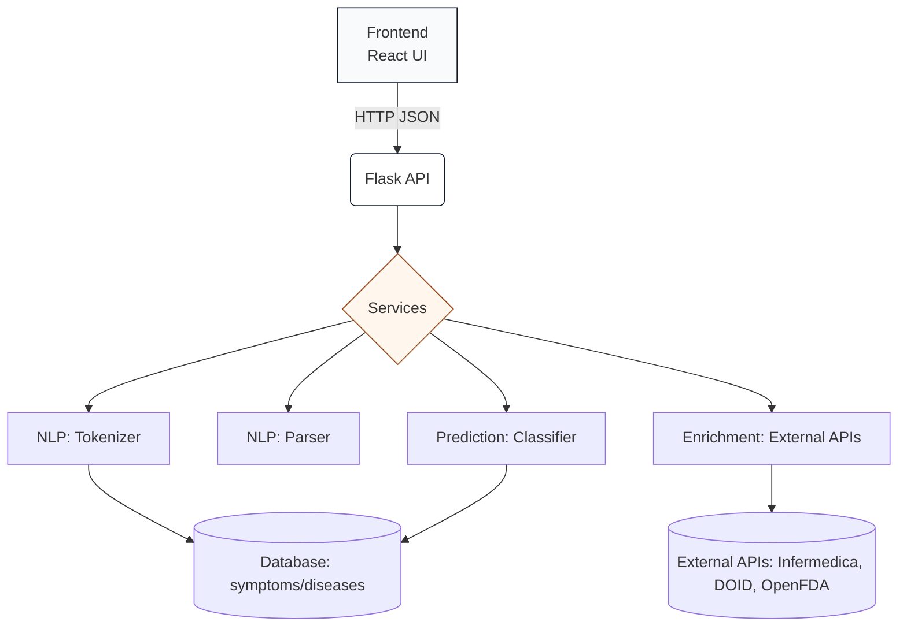
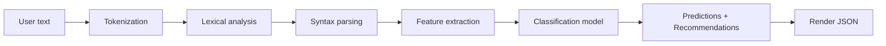

## ShifaaAI — Medical symptom analysis platform

ShifaaAI analyzes free-text symptom descriptions and returns likely conditions with confidence scores. The project is split into a lightweight React frontend and a Flask backend with modular services for NLP, inference and external enrichment.

---

## Architecture (graph)



The diagram shows the request flow: the frontend sends text to the Flask API, which orchestrates tokenization, parsing, classification and optional external enrichment before returning structured JSON.

---

## Processing pipeline (graph)



This pipeline is implemented as composable services so each stage can be tested, replaced, or scaled independently.

---

## Quick start

1. Create and activate a virtualenv (Python 3.10+)

```bash
python -m venv .venv
source .venv/bin/activate   # or `.venv\Scripts\activate` on Windows
pip install -r ShifaaAi/SHIFAAAI/backend/requirements.txt
```

2. Initialize database and run the backend

```bash
python ShifaaAi/SHIFAAAI/backend/create_database.py --force
python ShifaaAi/SHIFAAAI/backend/app.py
```

3. Serve frontend (simple static serve)

```bash
cd ShifaaAi/SHIFAAAI/frontend
python -m http.server 3000
# then open http://localhost:3000
```

---

## API (selected endpoints)

- GET /health — health check
- POST /api/analyze — run analysis pipeline (returns tokens, syntax, predictions)
- POST /api/infermedica/parse — use Infermedica parsing and diagnosis (requires API keys)

Example request:

```bash
curl -X POST http://127.0.0.1:5000/api/analyze \
  -H "Content-Type: application/json" \
  -d '{"text":"fièvre et toux depuis 3 jours"}'
```

---

## Project layout

- `SHIFAAAI/backend/` — Flask app, routes, services, models, utilities
- `SHIFAAAI/frontend/` — React UI and static assets
- `SHIFAAAI/database/` — DB schema and bootstrap script
- `SHIFAAAI/ai-engine/` — training, vectorizers, evaluation utilities

---

## Contributing

Use conventional commits: `feat`, `fix`, `docs`, `refactor`, `chore`. Please open issues/PRs on the repository.

---

## License

MIT — see LICENSE file.

---

Generated: concise README with architecture and pipeline graphs.
